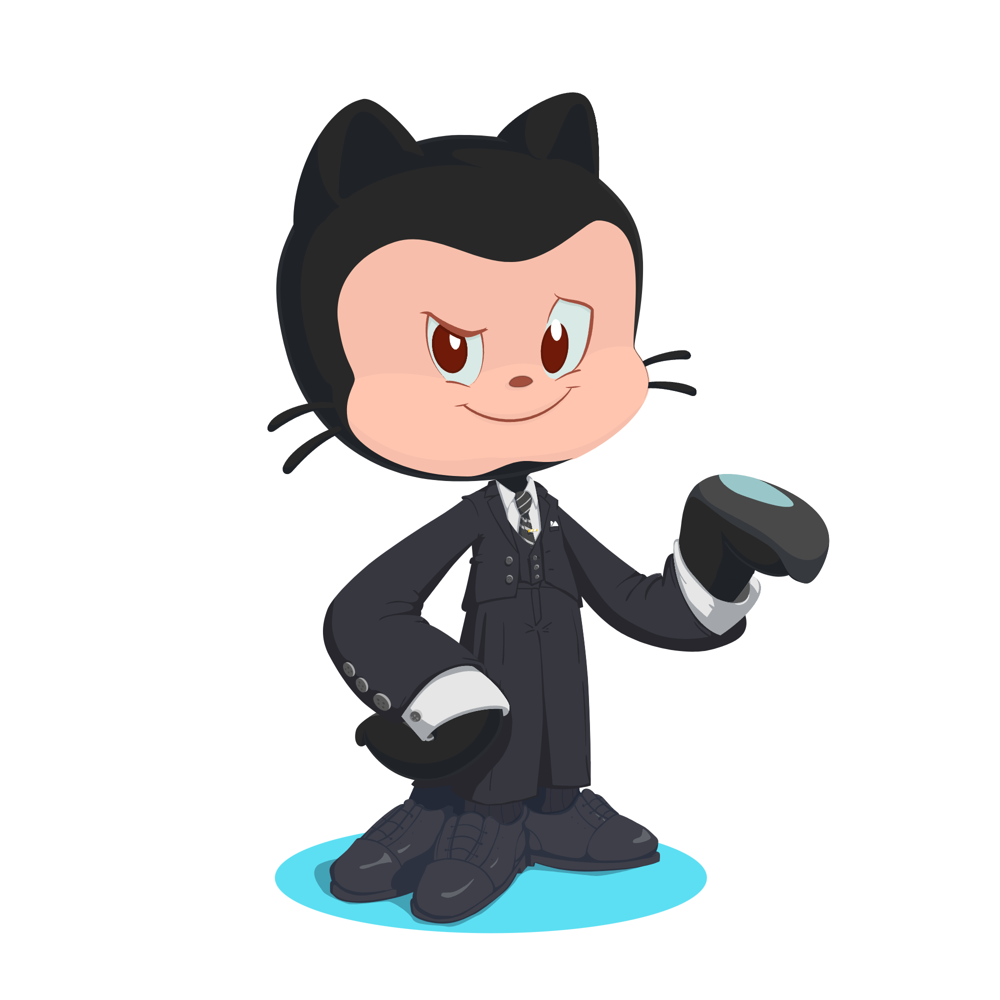

<div align="center">

</div>

###
<div align="center">
  
</div>

###

<h1 align="center">Hey there 👋, I'm Yash Varpe!</h1>

###  A little more about me...

```javascript
const yash = {
	pronouns: "He" | "Him",
	code: [JavaScript, React, HTML, CSS, Node.js, Express, MongoDB, SQL],
	tools: [React, Redux, Node, Express, MongoDB, SQL, Styled-Components],
	architecture: ["microservices", "event-driven", "design system pattern"],
	techCommunities: {
		member: "ChesslaBlab",
		contributor: "Open Source Projects",
		mentor: "Junior Developers",
	},
	challenge: "I am currently learning React and doing projects to solidify my understanding",
};
```
<h3 align="left">🛠 Languages and Tools:</h3>
<div align="left">
  
  
  
  
  
  
  
  
  
  
  
  
  
  
  
  
  
  
  
  
  
  
  
  
  
  
  
  
</div>
<h3 align="left">🌐 Connect with Me</h3>
<div align="left">
  <a href="https://linkedin.com/in/YashVarpe" target="_blank">
    
  </a>
  <a href="https://x.com/YashVarpe05" target="_blank">
    
  </a>
  <a href="https://discord.com/users/yash_varpe" target="_blank">
    
  </a>
  <a href="https://instagram.com/yash_varpe.05" target="_blank">
    
  </a>
  <a href="https://medium.com/@yashvarpe2005" target="_blank">
    
  </a>
</div>
<h3 align="left">🔥 My Stats:</h3>
<div align="center">
  
  
</div>
<div align="center">
  
</div>
<div align="center">
  
</div>
---

### 🌟 Let's Connect!
<em><b>I love connecting with people</b>. If you want to say <b>hi</b> or chat about tech, projects, or anything interesting, <b>I'd be thrilled to meet you!</b> 😊</em>
Looking forward to connecting with you! 😊


<div style="width:100%;height:0;padding-bottom:56%;position:relative;"><iframe src="https://giphy.com/embed/g9582DNuQppxC" width="100%" height="100%" style="position:absolute" frameBorder="0" class="giphy-embed" allowFullScreen></iframe></div><p><a href="https://giphy.com/gifs/hero0fwar-karmawhore-rhyming-g9582DNuQppxC">via GIPHY</a></p>


