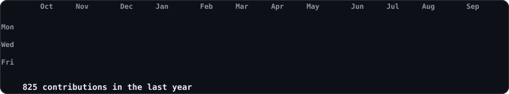
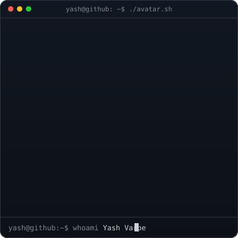
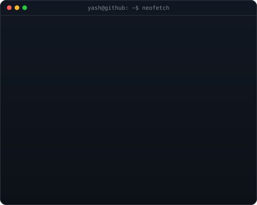

<!-- Terminal profile hero. The contribution graph refreshes daily through
     .github/workflows/update-profile-art.yml. Regenerate the portrait and
     info card with scripts/generate_ascii_avatar.py and
     scripts/generate_info_card.py. -->

<h3><code>yash@github ~ $ ./contributions.sh</code></h3>

 
 

<h2 align="center">Hey there 👋, I'm Yash Varpe</h2>

<h4 align="center">💻 Full Stack & Web3 Developer | 🚀 AI/ML Learner | 🎤 Speaker @ India FOSS 2025 | 🧠 Hackathon Organizer</h4>

<table>
  <tr>
    <td valign="top"></td>
    <td valign="top"></td>
  </tr>
</table>

###

  

---

<h3 align="left">🛠 Languages and Tools:</h3>

  
  
  
  
  
  
  
  
  
  
  
  
  
  
  
  
  
  
  
  
  
  
  
  
  
  
  
  

<h3 align="left">🌐 Connect with Me</h3>

  
  
  
  
  

---

<h3 align="left">🔥 My Stats:</h3>

 
 

### 🌟 Let's Connect!

<em><b>I love collaborating and sharing knowledge.</b> If you want to talk about Web3, DevOps, Open Source, or Hackathons — <b>let’s connect and build something amazing!</b> 🚀</em>

  

